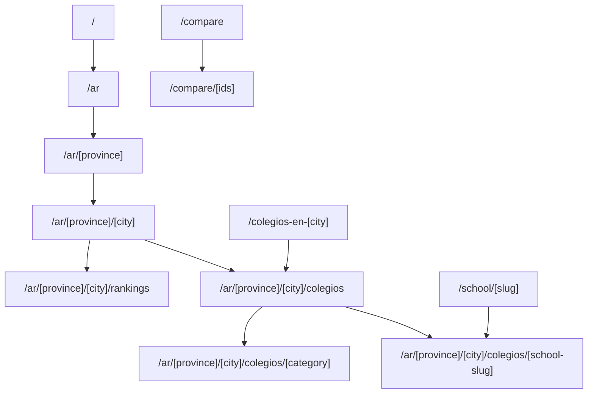

# SEO Architecture Spec - EduAdvisor (Next.js 14 App Router)

## 1. Objetivo
Diseñar una arquitectura SEO escalable para búsquedas geográficas y comparativas de colegios en Argentina, con capacidad de expansión multi-país sin generar contenido duplicado ni thin content.

## 2. Taxonomía Canónica de URLs

### Indexables (cuando pasan guardrails)
- `/ar`
- `/ar/[province]`
- `/ar/[province]/[city]`
- `/ar/[province]/[city]/colegios`
- `/ar/[province]/[city]/colegios/[school-slug]`
- `/ar/[province]/[city]/colegios/[category]` (`bilingues`, `deportes`, `jornada-completa`, `tecnologicos`)
- `/ar/[province]/[city]/rankings`
- `/compare`
- `/compare/[ids]`

### Legacy (consolidación por redirect permanente)
- `/colegios-en-[city]` -> `/ar/[province]/[city]/colegios`
- `/school/[slug]` -> `/ar/[province]/[city]/colegios/[slug]`
- `/ar/[province]/[city]/rankings/[category]` -> `/ar/[province]/[city]/colegios/[category]`

## 3. Diagrama de rutas

## 4. Reglas de indexación y canonical

### Index,follow
- Home geo (`/ar`, provincias, ciudades).
- Listado `/colegios` cuando pasa guardrails.
- Perfiles de colegio.
- Categorías solo con masa crítica.

### Noindex,follow
- Facetas y combinaciones por query params (`feeMin`, `feeMax`, `distance`, `tags`, etc.).
- Paginación profunda (`page>1`) en listados.
- Dashboards y panel admin.
- Rutas legacy de transición.

### Canonical
- Siempre absoluto y consistente (`https://eduadvisor.com/...`).
- Query params canonizan a URL base.
- Legacy canoniza al path definitivo.

## 5. Guardrails SEO (anti thin-content)
Motor implementado en `apps/web/lib/seo/guardrails.ts`:
- `schoolCount >= 8`
- `faqCount >= 5`
- `topPicksCount >= 3`
- Intro editorial única presente

Si falla cualquier condición:
- URL se renderiza en modo útil para usuario, pero `noindex,follow`.

## 6. Structured Data
Generadores en `apps/web/lib/seo/schema.ts`:
- `School` para perfiles.
- `ItemList` para listados/rankings/categorías.
- `BreadcrumbList` para todas las páginas indexables.
- `FAQPage` para geo listings.

## 7. Sitemaps y robots

### Endpoints
- `/sitemap_index.xml`
- `/sitemap_static.xml`
- `/sitemap_geo.xml`
- `/sitemap_schools.xml`
- `/sitemap_rankings.xml`
- Segmentación por chunks de 50k en `/sitemaps/{type}/{page}`.

### Robots
- `Sitemap: https://eduadvisor.com/sitemap_index.xml`
- Bloqueo de áreas privadas y facetas por query patterns.

## 8. SEO Health Monitoring
Dashboard interno en `/admin/seo-health` con:
- ciudades indexables vs bloqueadas por guardrails,
- colisiones de intención geo,
- colegios huérfanos de taxonomía geo,
- cobertura de estructura canónica.

## 9. QA automatizado
Playwright (`apps/web/tests/seo.spec.ts`):
- robots.txt correcto,
- sitemap index válido,
- noindex + canonical en facetas,
- noindex de paginación profunda.

## 10. Estado por sprint
- SEO-1: URL map + robots/canonical/sitemaps -> implementado.
- SEO-2: templates geo/rankings con bloques obligatorios -> implementado.
- SEO-3: metadata + JSON-LD -> implementado.
- SEO-4: guardrails + QA + dashboard interno -> implementado.
