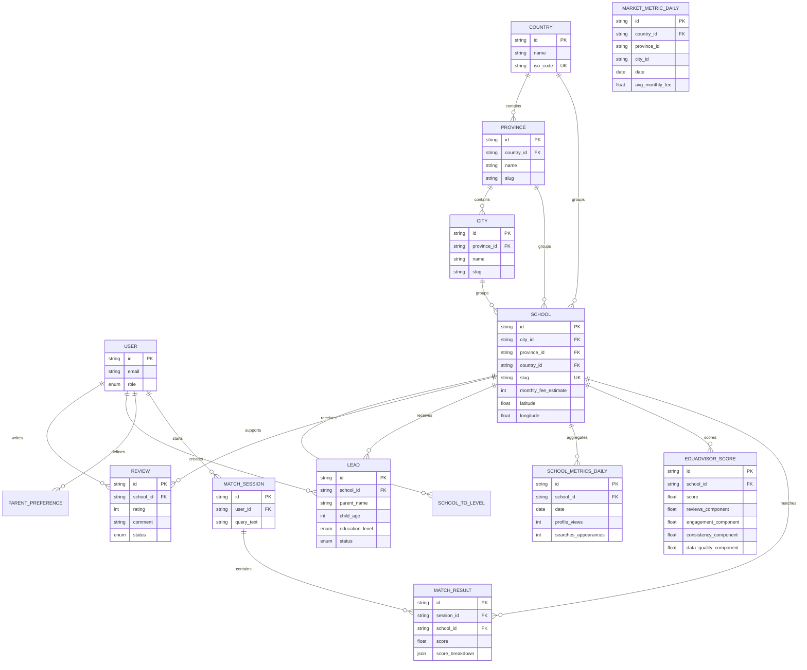

# Sprint 1 - Diagrama ER

```mermaid
erDiagram
  USER ||--o{ REVIEW : writes
  USER ||--o{ LEAD : creates
  USER ||--o{ PARENT_PREFERENCE : defines
  USER ||--o{ MATCH_SESSION : starts

  COUNTRY ||--o{ PROVINCE : contains
  PROVINCE ||--o{ CITY : contains

  COUNTRY ||--o{ SCHOOL : groups
  PROVINCE ||--o{ SCHOOL : groups
  CITY ||--o{ SCHOOL : groups

  SCHOOL ||--o{ SCHOOL_TO_LEVEL : supports
  SCHOOL ||--o{ REVIEW : receives
  SCHOOL ||--o{ LEAD : receives
  SCHOOL ||--o{ SCHOOL_METRICS_DAILY : aggregates
  SCHOOL ||--o{ EDUADVISOR_SCORE : scores
  SCHOOL ||--o{ MATCH_RESULT : matches

  MATCH_SESSION ||--o{ MATCH_RESULT : contains

  USER {
    string id PK
    string email
    enum role
  }

  COUNTRY {
    string id PK
    string name
    string iso_code UK
  }

  PROVINCE {
    string id PK
    string country_id FK
    string name
    string slug
  }

  CITY {
    string id PK
    string province_id FK
    string name
    string slug
  }

  SCHOOL {
    string id PK
    string city_id FK
    string province_id FK
    string country_id FK
    string slug UK
    int monthly_fee_estimate
    float latitude
    float longitude
  }

  REVIEW {
    string id PK
    string school_id FK
    int rating
    string comment
    enum status
  }

  LEAD {
    string id PK
    string school_id FK
    string parent_name
    int child_age
    enum education_level
    enum status
  }

  MATCH_SESSION {
    string id PK
    string user_id FK
    string query_text
  }

  MATCH_RESULT {
    string id PK
    string session_id FK
    string school_id FK
    float score
    json score_breakdown
  }

  SCHOOL_METRICS_DAILY {
    string id PK
    string school_id FK
    date date
    int profile_views
    int searches_appearances
  }

  MARKET_METRIC_DAILY {
    string id PK
    string country_id FK
    string province_id
    string city_id
    date date
    float avg_monthly_fee
  }

  EDUADVISOR_SCORE {
    string id PK
    string school_id FK
    float score
    float reviews_component
    float engagement_component
    float consistency_component
    float data_quality_component
  }
```
